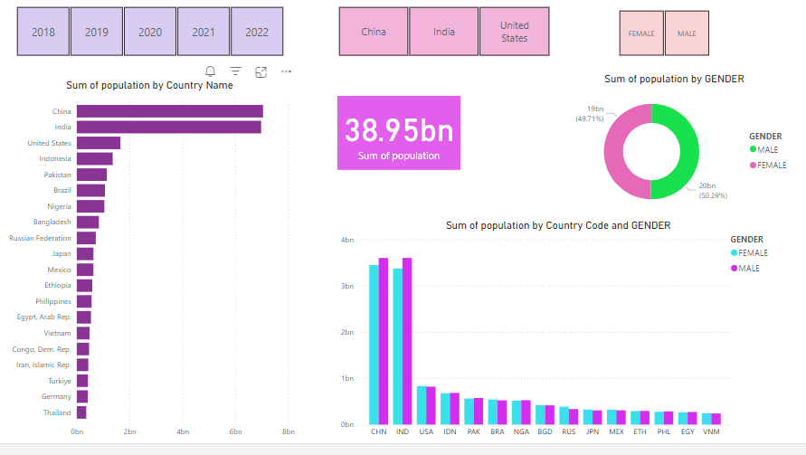
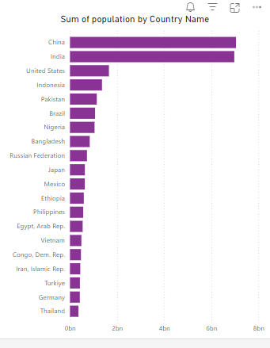
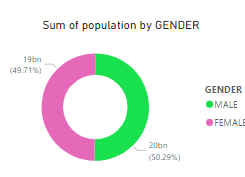
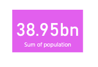
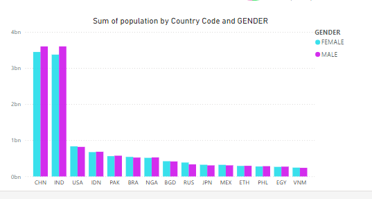

# 🌍 Population Analysis Dashboard

Welcome to the **Population Analysis Dashboard**, a powerful tool designed to provide an in-depth look into the population distribution of the world's most populous countries. This dashboard, created as part of an internship at Skill Craft Technologies, leverages data from 2018 to 2022 and offers insights into the demographic breakdowns, including gender distribution.

## 📊 Dashboard Overview

## 📌 Key Features

### 🌟 Top 20 Countries by Population

Explore the bar chart showcasing the top 20 countries by population. With China and India at the forefront, this visualization helps in understanding the global population landscape.

### 👫 Gender Distribution

Dive into the gender distribution within these populations:
- **Total Population**: 38,947 million
- **Gender Breakdown**: 
  - **Male**: 50.29%
  - **Female**: 49.71%

### 📈 Country-Specific Analysis

Gain detailed insights into the population structures of specific countries. This section highlights the major players like China, India, and the United States, offering a breakdown of their demographic data.

## 🎨 Visual Elements

- **Bar Chart**: Visual representation of the top 20 countries' populations, with a gender breakdown.
- **Donut Chart**: A clear depiction of the overall gender split.
- **Interactive Tiles**: Filters for years (2018-2022) and countries (China, India, United States) allow for a tailored viewing experience.

## 💡 Data Insights

Key takeaways include:
- **China** holds the title for the largest population, closely followed by **India**.
- The **United States** ranks third, with a notable difference in population size compared to the top two.
- The global gender distribution is almost balanced, with a slightly higher percentage of males.

## 🛠 Tools and Technologies

This dashboard is a product of advanced data visualization and analytical tools:
- **Power BI**: For creating interactive and dynamic visualizations.
- **Excel/MySQL**: For efficient data processing and management.

## 🚀 How to Use

1. **Year Selection**: Navigate through the years using the top filters to view specific data.
2. **Country Focus**: Click on any country to drill down into its demographic data.
3. **Gender Analysis**: Observe the gender distribution across different countries.

## 🔗 Dashboard Access

Access the full dashboard here: [Population Analysis Dashboard](https://app.powerbi.com/groups/me/reports/08dc6568-33c6-4d8d-87a6-4153118ac967?ctid=fca14908-1b94-4e46-a78c-a3abd2dba34b&pbi_source=linkShare)

## 📝 Conclusion

This Population Analysis Dashboard is a comprehensive tool for understanding global population trends and demographics. It provides valuable insights for demographic studies and strategic planning, making complex data accessible and understandable.
